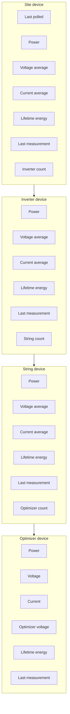
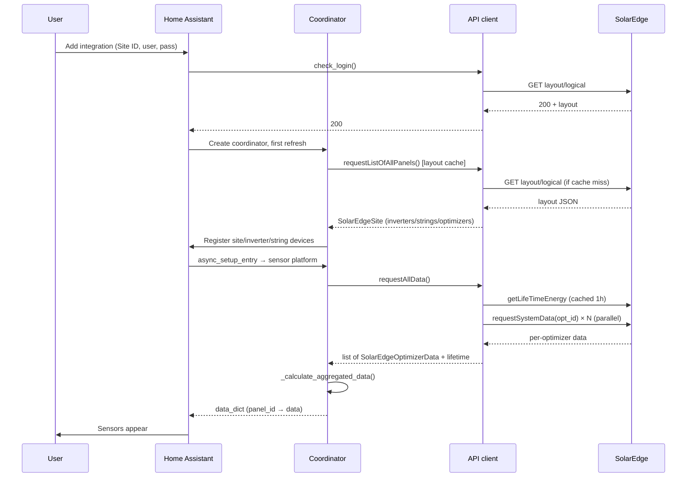
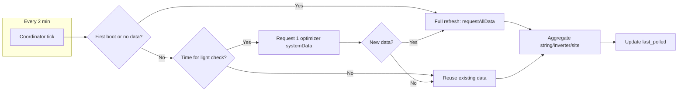

# SolarEdge Optimizers – Technical Documentation

**Full documentation for the SolarEdge Optimizers Home Assistant integration.**  
Use this as the main wiki page or copy sections into your GitHub wiki.

---

## Table of contents

1. [Overview](#1-overview)
2. [Architecture](#2-architecture)
3. [Device and entity hierarchy](#3-device-and-entity-hierarchy)
4. [Data flow and polling](#4-data-flow-and-polling)
5. [Installation](#5-installation)
6. [Configuration](#6-configuration)
7. [Sensors and entities reference](#7-sensors-and-entities-reference)
8. [Update behaviour and caches](#8-update-behaviour-and-caches)
9. [Offline and stale data handling](#9-offline-and-stale-data-handling)
10. [Internationalization (i18n)](#10-internationalization-i18n)
11. [API client and SolarEdge portal](#11-api-client-and-solaredge-portal)
12. [Troubleshooting and logging](#12-troubleshooting-and-logging)
13. [File structure and constants](#13-file-structure-and-constants)
14. [Credits and links](#14-credits-and-links)

---

## 1. Overview

The **SolarEdge Optimizers** integration pulls data from the SolarEdge monitoring portal into Home Assistant. It exposes:

- **Per-optimizer (per-panel)** sensors: voltage, current, optimizer voltage, power, lifetime energy, last measurement.
- **Aggregated** sensors at **string**, **inverter**, and **site** level: current (average), voltage (average), power, lifetime energy, last measurement, and child counts (optimizer/string/inverter count).
- A single **Last polled** sensor on the site device for monitoring update health.

### Features

| Feature | Description |
|--------|-------------|
| **Config flow** | Single-step setup: Site ID, username, password. |
| **Cloud polling** | Uses SolarEdge’s cloud API; no local hardware discovery. |
| **Adaptive polling** | Lightweight checks (one optimizer) every ~2–15 minutes; full refresh only when new data is detected or on first boot. |
| **Parallel API calls** | Optimizer data fetched in parallel for faster initial load. |
| **Caching** | Logical layout (1 h) and lifetime energy (1 h) cached to reduce API load. |
| **Multi-language** | Config flow and entity names translated; API locale follows HA language. |
| **Stale handling** | Live values (V, I, P) zeroed when last measurement is older than 1 hour. |
| **Reliability** | Temporary server/network errors (5xx, DNS) handled with cached data; connections closed on remove/reload. |

### Requirements

- **Home Assistant** (tested with recent versions).
- **SolarEdge monitoring account**: Site ID, username (email), password.
- **Network**: Outbound HTTPS to `monitoring.solaredge.com`.
- **Python dependency**: `jsonfinder==0.4.2` (in `manifest.json`).

---

## 2. Architecture

High-level components and how they interact:


### Component roles

| Component | Role |
|-----------|------|
| **Config flow** | Collects Site ID, username, password; validates via `check_login()`; creates config entry with translated title. |
| **`__init__.py`** | Sets up API client (with HA timezone and language), runs login check, creates coordinator, runs first refresh, forwards to sensor platform. |
| **Coordinator** | Runs every `UPDATE_DELAY` (2 min); implements adaptive polling (light check vs full refresh); builds data dict (optimizers + aggregated string/inverter/site); exposes data to sensors. |
| **Sensor platform** | Creates one device per site, inverter, string, optimizer; creates sensors (individual + aggregated); uses coordinator data and translation keys for names. |
| **API client** | Session-based requests to SolarEdge; layout and lifetime energy cached; parallel `requestSystemData` for full refresh; locale/language from HA. |

---

## 3. Device and entity hierarchy

How the physical layout maps to Home Assistant devices and entities:



- **Site** → **Inverters** → **Strings** → **Optimizers**.  
- **Device names** include the site so multiple sites don’t clash: **Site [site]**, **Inverter [site].[i]**, **String [site].[i].[s]**, **Optimizer [site].[i].[s].[o]** (e.g. Site 9999999, Inverter 9999999.1, String 9999999.1.1, Optimizer 9999999.1.1.1).  
- **Entity IDs** follow a path that may or may not include the site ID, depending on **Include SiteID in EntityID** (default off). When off: site level always has the site ID (e.g. `sensor.[base]power_[site]`); inverter/string/optimizer levels omit it (e.g. `sensor.[base]power_[i]_[s]_[o]`). When on: all levels include the site ID (e.g. `sensor.[base]power_[site]_[i]_[s]_[o]`). *[base]* is the optional Entity ID prefix from config (blank if not set). Entity IDs have no device-name prefix. This keeps entity IDs short by default while still unique per site.  
- In **Settings → Devices & services**, “Connected via” shows the parent (e.g. optimizer → string, string → inverter). Optimizers are grouped under their string device.  
- Entity names are translated (e.g. “Power”, “Last measurement”) and combined with the device name.

---

## 4. Data flow and polling

### Setup (first load)



### Ongoing updates (adaptive polling)



- **Light check interval**: ~2 minutes when data is recent; ~15 minutes when data is old or missing.  
- **Full refresh**: All optimizers + lifetime energy (from cache when possible).  
- **Lifetime energy** from API is cached for 1 hour; aggregations are computed from that cache.

---

## 5. Installation

### Via HACS (recommended)

1. **HACS** → **Custom repositories** → add `https://github.com/AndrewTapp/solaredgeoptimizers` as **Integration**.  
2. **Integrations** → find **SolarEdge Optimizers** → **Download**.  
3. **Restart Home Assistant.**  
4. **Settings** → **Devices & services** → **Add Integration** → search **SolarEdge Optimizers**.

### Manual

1. Clone or download the repo into `custom_components/solaredgeoptimizers/`.  
2. Restart Home Assistant.  
3. Add the integration as above.

Ensure `custom_components/solaredgeoptimizers/` contains at least: `__init__.py`, `config_flow.py`, `const.py`, `coordinator.py`, `manifest.json`, `sensor.py`, `solaredgeoptimizers.py`, `strings.json`, and the `translations/` folder.

---

## 6. Configuration

- **Single step**: Site ID, Username (email), Password, optional **Entity ID prefix**, and optional **Include Site ID in Entity ID** (default **off**).  
- **Entity ID prefix**: Optional. If set (e.g. `se_`), all entity IDs start with that prefix (e.g. `sensor.se_power_9999999`). Normalised to lowercase with spaces as underscores. Leave blank for no prefix. Useful when running multiple sites or avoiding clashes with other integrations.  
- **Include Site ID in Entity ID**: Optional, default **off**. When off, inverter/string/optimizer entity IDs omit the site ID (e.g. `sensor.power_1_1`); site level always includes the actual site ID (e.g. `sensor.power_2065855`). When on, all levels include the site ID in the path.  
- **Validation**: Calls SolarEdge `GET .../layout/logical` with HTTP Basic Auth; success = 200.  
- **Config entry title**: Translated, e.g. “SolarEdge Site 12345” (from `config.title_entry` with `%(siteid)s`).  
- **Errors**: “Failed to connect”, “Invalid authentication”, “Unexpected error” (keys `cannot_connect`, `invalid_auth`, `unknown`); all translatable.  
- **Abort**: “Device is already configured” when the same device is already set up.

No YAML configuration is required; all configuration is via the config flow.

---

## 7. Sensors and entities reference

### Per-optimizer (individual panel)

| Sensor | Device class | Unit | Description |
|--------|--------------|------|-------------|
| Power | power | W | Instantaneous power. |
| Voltage | voltage | V | Panel voltage. |
| Current | current | A | Panel current. |
| Optimizer voltage | voltage | V | Optimizer output voltage. |
| Lifetime energy | energy | kWh | Total energy (monotonic). Sourced from the API’s `unscaledEnergy` (Wh); the portal’s `units` field applies only to display values `energy` and `moduleEnergy`. At site level, when aggregated optimizer data is unreliable (e.g. very small total while portal has a real total), the site uses the portal’s total (sum of all `unscaledEnergy` from layout/energy) instead of aggregating. |
| Last measurement | timestamp | — | Time of last measurement from portal. |

- **Stale rule**: If last measurement is older than 1 hour, **Power, Voltage, Current, Optimizer voltage** are shown as **0**. Lifetime energy and Last measurement always show last known value.

### Per-string (aggregated)

| Sensor | Description |
|--------|--------------|
| Power | Sum of optimizer power (with recent data). |
| Current (average) | Average current of optimizers with recent data. |
| Voltage (average) | Average voltage of optimizers with recent data. |
| Lifetime energy | Sum of optimizer lifetime energy (from API, by string; uses `unscaledEnergy` in Wh). Site level: when reliable, sum of inverters; when unreliable (aggregated &lt; 100 kWh and portal total ≥ 100 kWh), uses portal total (sum of all `unscaledEnergy` from layout/energy). |
| Last measurement | Latest last measurement among optimizers in the string. |
| Optimizer count | Number of optimizers in the string. |

### Per-inverter (aggregated)

| Sensor | Description |
|--------|--------------|
| Power | Sum of string power. |
| Current (average) / Voltage (average) | Averages over strings with recent data. |
| Lifetime energy | Sum of string lifetime energy. |
| Last measurement | Latest among strings. |
| String count | Number of strings under the inverter. |

### Per-site (aggregated)

| Sensor | Description |
|--------|--------------|
| Same as inverter | But over all inverters. |
| Inverter count | Number of inverters. |
| **Last polled** | (Site device only.) When the integration last successfully finished an update. |

All aggregated sensors use the same naming pattern (e.g. “Power”, “Current (average)”) with the device name indicating the level. Entity IDs include the path so they are unique. When **Include Site ID in Entity ID** is **off** (default), inverter/string/optimizer IDs omit the site; site level and Last polled always show the site ID. When **on**, all levels include the site ID.

| Level    | Example (prefix blank, Include SiteID **off**) | Example (prefix blank, Include SiteID **on**) |
|----------|------------------------------------------------|-----------------------------------------------|
| Site     | `sensor.power_9999999`                         | `sensor.power_9999999`                        |
| Inverter | `sensor.power_1`                               | `sensor.power_9999999_1`                      |
| String   | `sensor.power_1_1`                             | `sensor.power_9999999_1_1`                    |
| Optimizer| `sensor.power_1_1_1`                           | `sensor.power_9999999_1_1_1`                  |
| Last polled | `sensor.last_polled`                        | `sensor.last_polled_9999999`                  |

Child-count sensors: `inverter_count` at site level, `child_count` at inverter (string count) and string (optimizer count) level, with the same path suffix.

---

## 8. Update behaviour and caches

| Item | Interval / TTL | Notes |
|------|----------------|--------|
| Coordinator tick | 2 minutes | `UPDATE_DELAY` in `const.py`. |
| Light check | 2 min (recent data) or 15 min (old/none) | Single optimizer `requestSystemData` to see if portal has new data. |
| Full refresh | When light check sees new data, or first boot / no data | `requestAllData()`: all optimizers + lifetime energy. |
| Layout (panels) cache | 1 hour | `requestListOfAllPanels()` → `requestLogicalLayout()`. |
| Lifetime energy cache | 1 hour | `get_lifetime_energy_cached()` → `getLifeTimeEnergy()`. Converted to kWh from `unscaledEnergy` (Wh); `units` applies only to display fields. |
| Full-refresh cooldown | 2 minutes | Avoids back-to-back full refreshes. |

Aggregations (string/inverter/site) are computed in the coordinator from optimizer data and cached lifetime energy; they are not separate API calls. **Site lifetime energy** uses aggregated data when reliable; when aggregated is very small (&lt; 100 kWh) and the portal total (sum of all `unscaledEnergy` from layout/energy) is large (≥ 100 kWh), the site uses the portal total so installations with unreliable per-optimizer lifetime data still get a correct site total.

---

## 9. Offline and stale data handling

- **Threshold**: `CHECK_TIME_DELTA` = 1 hour (in `const.py`).  
- **Rule**: For each optimizer, if `lastmeasurement` is older than 1 hour:
  - **Voltage, Current, Optimizer voltage, Power** → reported as **0** (so dashboards don’t show stale “live” values).
  - **Lifetime energy** and **Last measurement** → always last known value (historical view still possible).
- Aggregated sensors (string/inverter/site) only include optimizers with **recent** measurements in power/current/voltage; lifetime energy and last measurement still aggregate from all.

---

## 10. Internationalization (i18n)

- **Config flow**: Labels (Site id, Username, Password, **Entity ID prefix (optional)**, **Include Site ID in Entity ID**), errors, abort message, and config entry title are translated.  
- **Entity names**: Sensor names (Power, Voltage, Last measurement, etc.) use `translation_key` and are translated.  
- **API**: `locale` and `Accept-Language` (and cookie `SolarEdge_Locale`) follow HA language (e.g. `en`, `de`, `nl`). The SolarEdge API may return measurement keys in the user’s language (e.g. “Leistung [W]” in German); the integration recognises multiple locale variants and normalises decimal separators (e.g. comma to dot) so power/current/voltage work in all supported languages.

Supported languages:

| Code | Language   |
|------|------------|
| cs   | Čeština    |
| da   | Dansk      |
| de   | Deutsch    |
| el   | Ελληνικά   |
| en   | English    |
| es   | Español    |
| fi   | Suomi      |
| fr   | Français   |
| hu   | Magyar     |
| it   | Italiano   |
| ja   | 日本語     |
| nb   | Norsk      |
| nl   | Nederlands |
| pl   | Polski     |
| pt   | Português  |
| ru   | Русский    |
| sv   | Svenska    |
| tr   | Türkçe     |
| zh   | 中文       |

Translation files: `translations/<code>.json` (config, entity, and device sections). See [Internationalization (i18n)](internationalization.md) in the repo for details.

---

## 11. API client and SolarEdge portal

### Endpoints used

| Purpose | Method | Endpoint (concept) |
|---------|--------|---------------------|
| Login check / layout | GET | `.../api/sites/{siteid}/layout/logical` |
| Per-optimizer data | GET | `.../solaredge-web/p/systemData?reporterId={id}&...&locale={locale}` |
| Lifetime energy | POST | `.../api/sites/{siteid}/layout/energy` (and energy cache) |
| Session / CSRF | GET/POST | `.../solaredge-web/p/login`, etc. |

The layout/energy response returns per-optimizer (and per-string) entries with `energy`, `moduleEnergy`, `unscaledEnergy`, and `units`. The integration converts lifetime energy to kWh from **`unscaledEnergy`** (always in Wh) so values update correctly; the **`units`** field applies only to the display values `energy` and `moduleEnergy`. The coordinator also computes a **site total** (sum of all `unscaledEnergy` in the response) and uses it for the site-level lifetime energy sensor when aggregated optimizer data is unreliable (e.g. mixed or missing per-optimizer data).

- **Auth**: HTTP Basic Auth (username/password) for layout and systemData; web session (cookies + CSRF) for energy endpoint.  
- **Locale**: From HA language (e.g. `en` → `en_US`); used in `systemData` and request headers/cookies.

### Caching

- **Layout**: 1 h TTL; keyed by time; avoids repeated layout calls during setup and polling.  
- **Lifetime energy**: 1 h TTL; used by `requestAllData()` and coordinator aggregation.  
- **Panels list**: Same as layout (returned by `requestListOfAllPanels()`).

### Data models (conceptual)

- **SolarEdgeSite**: `siteId`, `inverters[]`.  
- **SolarEdgeInverter**: `inverterId`, `serialNumber`, `displayName`, `strings[]`.  
- **SolarEdgeString**: `stringId`, `displayName`, `optimizers[]`.  
- **SolarlEdgeOptimizer**: `optimizerId`, `serialNumber`, `displayName`.  
- **SolarEdgeOptimizerData**: `panel_id`, `voltage`, `current`, `power`, `optimizer_voltage`, `lifetime_energy` (kWh from API `unscaledEnergy`), `lastmeasurement`, etc.  
- **SolarEdgeAggregatedData**: `panel_id`, `entity_type` (string/inverter/site), same measurement fields plus `child_count`, etc.

---

## 12. Troubleshooting and logging

- **Log namespace**: `logging.getLogger(__package__)` (integration package).  
- **Levels**: `info` for setup and main steps, `debug` for URLs, responses, timezone, and per-optimizer details, `warning` for missing/zero measurements and server 5xx, `error` for auth/connect/parse failures.

### Logging

To enable debug logging for this integration, add the following to your `configuration.yaml`. If you already have a `logger:` section, add only the `logs:` entry (and the line under it) instead of duplicating the whole block.

```yaml
# Logging
logger:
  default: warning
  logs:
    custom_components.solaredgeoptimizers: debug
```

**How to edit `configuration.yaml` directly**

- **File Editor add-on** (recommended): Install **File editor** from the Add-on Store (Settings → Add-ons). Open it from the sidebar, open `configuration.yaml`, add or merge the `logger` block above, save, then use **Developer tools** → **YAML** → **Reload** or restart Home Assistant.
- **SSH / Terminal**: With the **SSH** or **Terminal & SSH** add-on, edit with `nano /config/configuration.yaml` (or `vi`). Save, then reload YAML or restart.
- **Other editors**: Same idea if you use Samba, Studio Code Server, or any access to the config directory: edit `configuration.yaml`, save, then reload YAML or restart.

### Common issues

| Symptom | What to check |
|--------|----------------|
| “Invalid authentication” | Correct Site ID, email, password; account can log in at monitoring.solaredge.com. |
| “Failed to connect” | Network, firewall, DNS; outbound HTTPS to monitoring.solaredge.com. |
| Config entry not loading | Logs for `ConfigEntryNotReady`; first refresh may fail if API is slow or returns errors. |
| Sensors stay 0 | Last measurement age (1 h rule); check “Last measurement” and “Last polled”; debug logs for API responses. If using a non-English HA language, ensure you’re on a version that supports locale-aware measurement keys (e.g. “Leistung [W]” for German). |
| Slow first load | Many optimizers → many parallel requests; layout and lifetime energy cached after first run. |
| Duplicate entity IDs (e.g. sensor.power_2) | Use a unique Entity ID prefix per site, or ensure you’re on a version that uses the new path-based entity IDs (site in path). |

- **5xx from SolarEdge**: Logged as temporary; coordinator retries on next cycle.  
- **DNS/connection errors** (e.g. “Failed to resolve monitoring.solaredge.com”): Lifetime energy and aggregation fall back to cached or empty data so the coordinator still completes; next cycle will retry.  
- **Unload**: Coordinator is removed and API client `close()` is called to release sessions.

---

## 13. File structure and constants

### Repo layout (relevant files)

```
solaredgeoptimizers/
├── __init__.py           # Entry point, setup, API + coordinator creation
├── config_flow.py        # Config flow, validation, translated title
├── const.py              # DOMAIN, intervals, sensor type constants
├── coordinator.py        # DataUpdateCoordinator, adaptive polling, aggregation
├── manifest.json         # Domain, version, requirements
├── sensor.py             # Sensor entities (optimizer, aggregated, last polled)
├── solaredgeoptimizers.py # API client, data models, SolarEdge API calls
├── strings.json          # Config flow strings (references to common keys)
├── translations/         # en.json, nl.json, de.json, ...
└── docs/
    ├── internationalization.md
    └── Wiki-Home.md      # This file
```

### Main constants (`const.py`)

| Constant | Value | Meaning |
|----------|--------|--------|
| `DOMAIN` | `"solaredgeoptimizers"` | Integration domain. |
| `CONF_ENTITY_PREFIX` | `"entity_id_prefix"` | Optional config key for entity ID prefix (e.g. `se_`). |
| `CONF_INCLUDE_SITE_ID_IN_ENTITY_ID` | `"include_site_id_in_entity_id"` | Optional config key; when true, entity IDs for inverter/string/optimizer include the site ID (default false). Site level always includes site ID. |
| `UPDATE_DELAY` | 2 minutes | Coordinator update interval. |
| `CHECK_TIME_DELTA` | 1 hour | Age threshold for zeroing live values. |
| `SENSOR_TYPE_*` | e.g. `Current`, `Power`, `Voltage` | Sensor type identifiers for individual and aggregated sensors. |

---

## 14. Credits and links

- **Repository**: [github.com/AndrewTapp/solaredgeoptimizers](https://github.com/AndrewTapp/solaredgeoptimizers)  
- **Issues**: [GitHub Issues](https://github.com/AndrewTapp/solaredgeoptimizers/issues)  
- **Original integration**: [@proudem](https://github.com/proudem)  
- **Thanks**: [@Mariusthvdb](https://github.com/Mariusthvdb) for help with this fork  

---

*This document is the main technical reference for the SolarEdge Optimizers Home Assistant integration. For end-user installation and feature summary, see the main [README](https://github.com/AndrewTapp/solaredgeoptimizers/blob/main/README.md).*
