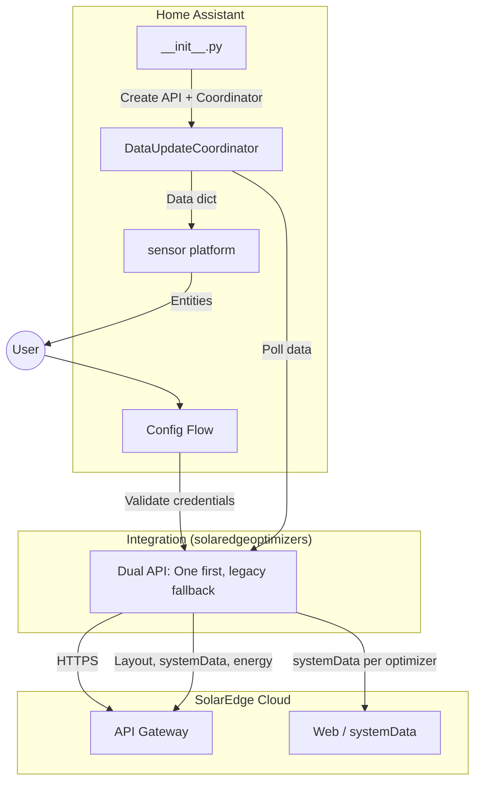

# SolarEdge Optimizers – Technical Documentation

**Full documentation for the SolarEdge Optimizers Home Assistant integration.**  
Use this as the main wiki page or copy sections into your GitHub wiki.

---

## Table of contents

1. [Overview](#1-overview)
2. [Architecture](#2-architecture)
3. [Device and entity hierarchy](#3-device-and-entity-hierarchy)
4. [Data flow and polling](#4-data-flow-and-polling)
5. [Installation](#5-installation)
6. [Configuration](#6-configuration)
7. [Sensors and entities reference](#7-sensors-and-entities-reference)
8. [Update behaviour and caches](#8-update-behaviour-and-caches)
9. [Offline and stale data handling](#9-offline-and-stale-data-handling)
10. [Internationalization (i18n)](#10-internationalization-i18n)
11. [API client and SolarEdge portal](#11-api-client-and-solaredge-portal)
12. [Troubleshooting and logging](#12-troubleshooting-and-logging)
13. [File structure and constants](#13-file-structure-and-constants)
14. [Credits and links](#14-credits-and-links)

---

## 1. Overview

The **SolarEdge Optimizers** integration pulls data from the SolarEdge monitoring portal into Home Assistant. It exposes:

- **Per-optimizer (per-panel)** sensors: voltage, current, optimizer voltage, power, temperature (SolarEdge One only), lifetime energy, last measurement.
- **Aggregated** sensors at **string**, **inverter**, and **site** level: current (average), voltage (average), power, lifetime energy, last measurement, and child counts (optimizer/string/inverter count).
- A **Last polled** sensor and an **Obtained from** sensor on the site device (last polled = when the integration last fetched data; obtained from = "One API" or "Legacy API" depending on which source provided the current data).

### Features

| Feature | Description |
|--------|-------------|
| **Config flow** | Single-step setup: Site ID, username, password, optional Entity ID prefix, optional Include Site ID in Entity ID. Field order: site ID → username → password → Entity ID prefix → Include Site ID in Entity ID. One config entry per site (same site cannot be added twice). Validation uses dual API: login succeeds if either SolarEdge One or legacy returns 200. |
| **Re-authentication** | When the API returns 401 (invalid or expired credentials), the integration raises `ConfigEntryAuthFailed`; Home Assistant shows a re-auth form (username, password). Only credentials are updated; options (entity ID prefix, Include Site ID in Entity ID) are preserved. Re-auth step and abort messages are translated. |
| **Options (reconfigure)** | Entity ID prefix and Include Site ID in Entity ID can be changed via the integration’s Configure (options flow) without removing the entry. The form shows Entity ID prefix (description shows current prefix; leave empty to remove it) and Include Site ID in Entity ID. Saving reloads the integration. Documented: entity IDs and unique_ids may change, so history/statistics can be lost. |
| **Cloud polling** | Uses SolarEdge’s cloud API; no local hardware discovery. |
| **Adaptive polling** | Lightweight checks every ~2–15 minutes; full refresh when new data is detected, on first boot, or **every 30 minutes when data is from legacy** (re-try One so the integration can switch back). When using **SolarEdge One:** up to 5 optimizers chosen at random, one batch API call (`requestSystemDataBatch`). When using **legacy API:** one representative optimizer. The integration tries One first; if One has no valid measurements or fails, it uses legacy. |
| **Parallel API calls** | Optimizer data fetched in parallel for full refresh. |
| **Sensor setup optimization** | After the coordinator’s first refresh, the sensor platform uses `coordinator.data` for optimizer info when present and only calls the API for optimizers missing from that data, avoiding duplicate fetches and speeding setup. |
| **Caching** | Logical layout (1 h) and lifetime energy (1 h) cached to reduce API load. |
| **Multi-language** | Config flow (including re-auth step and abort messages) and entity names translated; API locale follows HA language. |
| **Stale handling** | Live values (V, I, P) zeroed when last measurement is older than threshold: **1 hour** when data is from One API, **2 hours** when from Legacy API. The **Obtained from** sensor on the site device shows "One API" or "Legacy API". |
| **Reliability** | Temporary server/network errors (5xx, DNS) handled with cached data. API sessions and connections are closed on remove/reload (OAuth session in SolarEdge One is used as a context manager and closed after login; legacy and dual API clients expose `close()` called on unload). **SolarEdge One** optimizer data requests use a 60 s timeout and one automatic retry on read/connect timeout to reduce failures when the portal is slow. |
| **Removal cleanup** | When the integration is deleted from **Settings → Integrations**, config flow’s `async_remove_entry` calls the shared helper `remove_entities_and_devices_for_entry` (defined in `__init__.py`), which removes all associated entities and devices from the registries. The same helper is used on unload. No leftover registry entries remain. |
| **Hardware replacement** | Optimizer, string, and inverter devices and entities are identified by **logical position** (e.g. inverter index, string index, optimizer index), not by serial number. When an optimizer or inverter is replaced (e.g. after a hardware failure), the same device and sensors continue to show the new unit’s data after the next refresh; no duplicate entities. Data is keyed by position so sensor lookup finds the unit currently at that position. If duplicates already exist from an earlier swap, remove the integration and add it again to clean up. |

### Requirements

- **Home Assistant** (tested with recent versions).
- **SolarEdge monitoring account**: Site ID, username (email), password.
- **Network**: Outbound HTTPS to `monitoring.solaredge.com` (legacy and SolarEdge One both use this host; SolarEdge One also uses `login.solaredge.com` for OAuth).
- **Python dependency**: `jsonfinder==0.4.2` (in `manifest.json`; used by the legacy API client only).

---

## 2. Architecture

High-level components and how they interact:



### Component roles

| Component | Role |
|-----------|------|
| **Config flow** | Collects Site ID, username, password, optional Entity ID prefix, optional Include Site ID in Entity ID; validates via dual API `check_login()` (succeeds if either One or legacy returns 200); creates config entry with translated title. On setup, migrates existing entries to remove deprecated `use_solaredge_one`. On removal, `async_remove_entry` calls the shared helper `remove_entities_and_devices_for_entry` to clear entities and devices for that config entry. |
| **`__init__.py`** | Runs migration to remove `use_solaredge_one` from data/options; sets up dual API client (`SolarEdgeDualAPI` from `api_dual.py`, with HA timezone and language), runs login check, creates coordinator, runs first refresh, forwards to sensor platform. Defines `remove_entities_and_devices_for_entry(hass, entry)`, used by both unload and config flow for registry cleanup. |
| **Coordinator** | Runs every `UPDATE_DELAY` (2 min); implements adaptive polling (light check vs full refresh); when data is from legacy, forces full refresh every 30 min (`REVERT_TO_ONE_RETRY_INTERVAL`) to re-try One; when not doing a full refresh, still refreshes optimizer temperatures (SolarEdge One) via `_refresh_temperature_when_no_full_refresh()` so temperature stays updated ~every 15 min; builds data dict keyed by serial and by (inv_idx, str_idx, opt_idx) for optimizers so hardware swap keeps same sensor; full refresh timeout 10 min; exposes `_obtained_from` ("One API" or "Legacy API") to the Obtained from sensor. Types the API client via `SolarEdgeAPIProtocol` (`api.py`). |
| **Sensor platform** | At setup, removes existing sensor entities for this config entry so new entity IDs match current options (e.g. prefix, Include Site ID). Creates one device per site, inverter, string, optimizer (devices keyed by position so hardware swap does not duplicate). **String and inverter aggregated sensors** use the same position-based device identifiers and `via_device` as the coordinator (`_set_aggregated_device_info`), so they attach to the devices created in `_register_site_and_inverter_devices` and the hierarchy (site → inverter → string → optimizer) is correct; avoids “references a non existing via_device” and duplicate inverter devices. Creates sensors (individual + aggregated + **Last polled** + **Obtained from** on site device). Optimizer sensors look up coordinator data by (inv_idx, str_idx, opt_idx) first so replacement hardware at the same position updates the same entity. Uses `coordinator.data` for optimizer info when available (after first refresh), only calling the API for optimizers missing from that data; deduplicates optimizer tasks by position. |
| **API client** | **Dual API** (`api_dual.py`): tries **SolarEdge One** (`solaredge_one_api.py`) first; if One returns no valid measurements or fails (e.g. login), uses **legacy** (`solaredgeoptimizers.py`). Exposes `_obtained_from` for the site-level sensor. Both backends conform to `SolarEdgeAPIProtocol` (`api.py`). Layout and lifetime energy cached; parallel optimizer data for full refresh; locale/language from HA. |

---

## 3. Device and entity hierarchy

How the physical layout maps to Home Assistant devices and entities:

```mermaid
flowchart TD
    subgraph Site[Site device]
        LP[Last polled]
        OF[Obtained from]
        S_P[Power]
        S_V[Voltage average]
        S_C[Current average]
        S_E[Lifetime energy]
        S_L[Last measurement]
        S_I[Inverter count]
    end

    subgraph Inv[Inverter device]
        I_P[Power]
        I_V[Voltage average]
        I_C[Current average]
        I_E[Lifetime energy]
        I_L[Last measurement]
        I_S[String count]
    end

    subgraph Str[String device]
        R_P[Power]
        R_V[Voltage average]
        R_C[Current average]
        R_E[Lifetime energy]
        R_L[Last measurement]
        R_O[Optimizer count]
    end

    subgraph Opt[Optimizer device]
        O_P[Power]
        O_V[Voltage]
        O_C[Current]
        O_OV[Optimizer voltage]
        O_T[Temperature]
        O_E[Lifetime energy]
        O_L[Last measurement]
    end

    Site --> Inv
    Inv --> Str
    Str --> Opt
```



- **Site** → **Inverters** → **Strings** → **Optimizers**.  
- **Device names** include the site so multiple sites don’t clash: **Site [site]**, **Inverter [site].[i]**, **String [site].[i].[s]**, **Optimizer [site].[i].[s].[o]** (e.g. Site 9999999, Inverter 9999999.1, String 9999999.1.1, Optimizer 9999999.1.1.1).  
- **Device model and serial:** When using **SolarEdge One**, each **optimizer** device shows the optimizer **model** (e.g. P405-4RM4MRM-NA25) and serial number from the API; each **inverter** device shows the inverter **model** (e.g. SE5000H-RW000BNN4, from `fullModel`) and serial number. Legacy API does not fetch model for inverters; optimizer model may come from layout where available.  
- **Position-based device identity:** Devices and sensor data are keyed by **logical position** (inverter index, string index, optimizer index), not by serial number. The coordinator creates site, inverter, and string devices with these identifiers; the sensor platform attaches **aggregated** (string/inverter) sensors to the same devices so the hierarchy (site → inverter → string → optimizer) is correct and there is no “non existing via_device” or duplicate inverter. When an optimizer or inverter is replaced (hardware swap), the same device and sensors show the new unit’s data after the next refresh; no duplicate entities. Device identifiers use `entry_id_inv_{i}`, `entry_id_str_{i}_{s}`, `entry_id_opt_{i}_{s}_{o}` so identity is stable across hardware replacement.  
- **Entity IDs** follow a path that may or may not include the site ID, depending on **Include SiteID in EntityID** (default off). When off: site level always has the site ID (e.g. `sensor.[base]power_[site]`); inverter/string/optimizer levels omit it (e.g. `sensor.[base]power_[i]_[s]_[o]`). When on: all levels include the site ID (e.g. `sensor.[base]power_[site]_[i]_[s]_[o]`). *[base]* is the optional Entity ID prefix from config (blank if not set). Entity IDs have no device-name prefix. This keeps entity IDs short by default while still unique per site.  
- In **Settings → Devices & services**, “Connected via” shows the parent (e.g. optimizer → string, string → inverter). Optimizers are grouped under their string device.  
- Entity names are translated (e.g. “Power”, “Last measurement”) and combined with the device name.

---

## 4. Data flow and polling

### Setup (first load)

```mermaid
sequenceDiagram
    participant U as User
    participant HA as Home Assistant
    participant C as Coordinator
    participant API as API client
    participant SE as SolarEdge

    U->>HA: Add integration (Site ID, user, pass)
    HA->>API: check_login()
    Note over API: Dual API: try One, then legacy if needed
    API->>SE: GET layout/logical (One or legacy)
    SE-->>API: 200 + layout
    API-->>HA: 200
    HA->>C: Create coordinator, first refresh
    C->>API: requestListOfAllPanels() [layout cache]
    API->>SE: GET layout/logical (if cache miss)
    SE-->>API: layout JSON
    API-->>C: SolarEdgeSite (inverters/strings/optimizers)
    C->>HA: Register site/inverter/string devices
    C->>API: requestAllData()
    Note over API: Dual API: try One first; if no valid measurements or fail, call legacy
    API->>SE: getLifeTimeEnergy / layout/energy (cached 1h)
    API->>SE: requestSystemData(opt_id) × N or One batch (parallel)
    SE-->>API: per-optimizer data
    API-->>C: list of SolarEdgeOptimizerData + lifetime, _obtained_from set
    C->>C: _calculate_aggregated_data(); store _obtained_from
    C-->>HA: data_dict (panel_id + position → data)
    HA->>C: async_setup_entry → sensor platform
    Note over HA,C: Sensor platform uses coordinator.data for optimizer info when present; only calls API for optimizers missing from data (avoids duplicate fetches)
    HA->>U: Sensors appear
```

### Ongoing updates (adaptive polling)

```mermaid
flowchart LR
    subgraph Every 2 min
        TICK[Coordinator tick]
    end

    TICK --> FIRST{First boot or no data?}
    FIRST -->|Yes| FULL[Full refresh: requestAllData]
    FIRST -->|No| LIGHT{Time for light check?}
    LIGHT -->|No| REUSE[Reuse existing data]
    LIGHT -->|Yes| ONE[Light check: 1 opt (legacy) or batch of ≤5 random (SE One)]
    ONE --> NEW{New data?}
    NEW -->|Yes| FULL
    NEW -->|No| REUSE
    FULL --> AGG[Aggregate string/inverter/site]
    REUSE --> AGG
    AGG --> LAST[Update last_polled and obtained_from]
```

**Note:** A full refresh is also triggered when data is from legacy and at least 30 minutes have passed since the last full refresh (re-try One so the integration can switch back). When the coordinator **reuses** existing data (no full refresh), it still refreshes optimizer temperatures if the API supports it (e.g. SolarEdge One) via `_refresh_temperature_when_no_full_refresh()`, using `get_optimizer_temperatures_cached()` so temperatures stay updated about every 15 minutes.

- **Light check interval**: ~2 minutes when data is recent; ~15 minutes when data is old or missing.  
- **Light check strategy**: Which API is used follows the **last full refresh**. When the dual API last used **legacy** for full data, the light check uses a single representative optimizer (`requestSystemData`). When it last used **SolarEdge One**, the light check uses up to 5 optimizers chosen at random; one batch request (`requestSystemDataBatch`) returns live data for all of them. If any has a newer `lastMeasurement` than the coordinator’s latest, a full refresh is triggered. Random selection avoids always checking the same panel (e.g. one that’s often in shade).  
- **Full refresh**: Coordinator calls the dual API's `requestAllData()`: dual API tries One first; if no valid measurements or fail, uses legacy; sets `_obtained_from`. All optimizers + lifetime energy (from cache when possible). When data is currently from **legacy** (`_obtained_from` = Legacy API), the coordinator forces a full refresh **every 30 minutes** (`REVERT_TO_ONE_RETRY_INTERVAL` in `const.py`) so One is re-tried and the integration can switch back when One is available.  
- **Lifetime energy**: Dual API's `get_lifetime_energy_cached()` returns the cache from whichever API was last used for full data (One or legacy). TTL 1 hour; aggregations from that cache.  
- **Sensor setup**: After the coordinator’s first refresh, the sensor platform receives `data_dict` and uses it for optimizer info when creating entities; it only calls the API for optimizers missing from that data, so setup avoids duplicate fetches and is faster.

---

## 5. Installation

### Via HACS (recommended)

1. **HACS** → **Custom repositories** → add `https://github.com/AndrewTapp/solaredgeoptimizers` as **Integration**.  
2. **Integrations** → find **SolarEdge Optimizers** → **Download**.  
3. **Restart Home Assistant.**  
4. **Settings** → **Devices & services** → **Add Integration** → search **SolarEdge Optimizers**.

### Manual

1. Clone or download the repo into `custom_components/solaredgeoptimizers/`.  
2. Restart Home Assistant.  
3. Add the integration as above.

Ensure `custom_components/solaredgeoptimizers/` contains at least: `__init__.py`, `api.py`, `api_dual.py`, `config_flow.py`, `const.py`, `coordinator.py`, `manifest.json`, `sensor.py`, `solaredgeoptimizers.py`, `solaredge_one_api.py`, `strings.json`, and the `translations/` folder.

---

## 6. Configuration

- **Single step**: Site ID, Username (email), Password, optional **Entity ID prefix**, and optional **Include Site ID in Entity ID** (default **off**). **Field order** in the form: Site ID → Username → Password → Entity ID prefix → Include Site ID in Entity ID.  
- **Dual API**: The integration always uses a dual API: it tries the **SolarEdge One API** first (`monitoring.solaredge.com/services/layout/...`). If One returns no valid measurements (e.g. all optimizers with empty measurements) or One login fails, it automatically falls back to the **legacy** SolarEdge API. When One starts returning valid data again, the integration switches back to One—either when the light check sees newer data from One, or **every 30 minutes** when data is currently from legacy (coordinator forces a full refresh to re-try One). A site-level **Obtained from** sensor shows "One API" or "Legacy API". When data is from One, optimizer and inverter devices show model (e.g. P405-4RM4MRM-NA25, SE5000H-RW000BNN4) and serial. Validation: `check_login()` succeeds if either One or legacy returns 200.  
- **One config entry per site**: The config flow sets `unique_id` to the Site ID. If you try to add the same site again, `_abort_if_unique_id_configured()` runs and the flow aborts with "Device is already configured". Multiple sites require one integration entry per site (each with a different Site ID).  
- **Entity ID prefix**: Optional. If set (e.g. `se_`), all entity IDs start with that prefix (e.g. `sensor.se_power_9999999`). Normalised to lowercase with spaces as underscores. Leave blank for no prefix. Useful when running multiple sites or avoiding clashes with other integrations. When upgrading from an older version without removing the integration, this defaults to blank if the key is not present.  
- **Include Site ID in Entity ID**: Optional, default **off**. When off, inverter/string/optimizer entity IDs omit the site ID (e.g. `sensor.power_1_1`); site level always includes the actual site ID (e.g. `sensor.power_9999999`). When on, all levels include the site ID in the path. When upgrading from an older version without removing the integration, this defaults to off if the key is not present.  
- **Validation**: Uses dual API `check_login()`: tries SolarEdge One first, then legacy; success if either returns 200.  
- **Config entry title**: Translated, e.g. “SolarEdge Site 12345” (from `config.title_entry` with `%(siteid)s`).  
- **Errors**: “Failed to connect”, “Invalid authentication”, “Unexpected error” (keys `cannot_connect`, `invalid_auth`, `unknown`); all translatable.  
- **Abort**: “Device is already configured” when the same site is already set up; "Re-authentication successful" and "Re-authentication could not find the config entry." for the re-auth flow (all translatable).  
- **Re-authentication**: If the API returns 401 (invalid or expired credentials), `__init__.py` raises `ConfigEntryAuthFailed`. Home Assistant then starts the reauth flow: `async_step_reauth` sets `unique_id` and runs `async_step_reauth_confirm`, which shows a form (title, description, username, password) from `config.step.reauth_confirm`. On success, only the entry’s username and password are updated in `entry.data`; options (entity ID prefix, Include Site ID in Entity ID) are left unchanged. The integration is then reloaded. Abort reasons: `reauth_successful`, `reauth_entry_missing`. All re-auth strings are in `translations/<code>.json`.  
- **Options (reconfigure)**: Users can change **Entity ID prefix** or **Include Site ID in Entity ID** without deleting the entry: use the integration’s **Configure** (options flow). The flow shows a form (step_id `init`; translations from **options.step.init**: title, description, data.entity_id_prefix, data.include_site_id_in_entity_id). **Field order**: Entity ID prefix, then Include Site ID in Entity ID. The description shows the current prefix (`{current_entity_id_prefix}`); leave the Entity ID prefix field empty to remove the prefix. Values are stored in `entry.options` and override `entry.data` when the integration reads config. On save, the options flow updates the entry and triggers a reload so sensors are recreated. **Important:** Changing these options can change entity IDs and `unique_id`s. When `unique_id` or entity ID changes, Home Assistant may treat entities as new, so **history and statistics for the previous entities can be lost**. The options form description warns users and recommends backing up or exporting data first.

No YAML configuration is required; all configuration is via the config flow.

---

## 7. Sensors and entities reference

### Per-optimizer (individual panel)

| Sensor | Device class | Unit | Description |
|--------|--------------|------|-------------|
| Power | power | W | Instantaneous power. |
| Voltage | voltage | V | Panel voltage. |
| Current | current | A | Panel current. |
| Optimizer voltage | voltage | V | Optimizer output voltage. |
| Temperature | temperature | °C | Optimizer temperature from SolarEdge One API (layout/energy by-inverter with `include-max-temperature`). Only available when using One API; shows “unknown” when missing or when using legacy API. Refreshed about every 15 min via cached API even when the coordinator does not do a full refresh. Not zeroed when stale. |
| Lifetime energy | energy | kWh | Total energy (monotonic). Sourced from the API’s `unscaledEnergy` (Wh); the portal’s `units` field applies only to display values `energy` and `moduleEnergy`. At site level, when aggregated optimizer data is unreliable (e.g. very small total while portal has a real total), the site uses the portal’s total (sum of all `unscaledEnergy` from layout/energy) instead of aggregating. |
| Last measurement | timestamp | — | Time of last measurement from portal. |

- **Stale rule**: If last measurement is older than the threshold (**1 h** when data is from One API, **2 h** when from Legacy API—see **Obtained from** sensor), **Power, Voltage, Current, Optimizer voltage** are shown as **0**. **Temperature** (when from SolarEdge One) is not zeroed; it shows the last known value or unknown if missing. Lifetime energy and Last measurement always show last known value.

### Per-string (aggregated)

| Sensor | Description |
|--------|--------------|
| Power | Sum of optimizer power (with recent data). |
| Current (average) | Average current of optimizers with recent data. |
| Voltage (average) | Average voltage of optimizers with recent data. |
| Lifetime energy | Sum of optimizer lifetime energy (from API, by string; uses `unscaledEnergy` in Wh). Site level: when reliable, sum of inverters; when unreliable (aggregated below `RELIABLE_THRESHOLD_KWH` and portal total ≥ that threshold), uses portal total (sum of all `unscaledEnergy` from layout/energy). |
| Last measurement | Latest last measurement among optimizers in the string. |
| Optimizer count | Number of optimizers in the string (always an integer). |

### Per-inverter (aggregated)

| Sensor | Description |
|--------|--------------|
| Power | Sum of string power. |
| Current (average) / Voltage (average) | Averages over strings with recent data. |
| Lifetime energy | Sum of string lifetime energy. |
| Last measurement | Latest among strings. |
| String count | Number of strings under the inverter (always an integer). |

### Per-site (aggregated)

| Sensor | Description |
|--------|--------------|
| Same as inverter | But over all inverters. |
| Inverter count | Number of inverters (always an integer). |
| **Last polled** | (Site device only.) When the integration last successfully finished an update. |
| **Obtained from** | (Site device only.) Which API provided the current data: **"One API"** or **"Legacy API"**. Entity ID: `sensor.[prefix]obtained_from_[site]` or `sensor.[prefix]obtained_from` when site ID is not included in entity IDs. |

All aggregated sensors use the same naming pattern (e.g. “Power”, “Current (average)”) with the device name indicating the level. Entity IDs include the path so they are unique. When **Include Site ID in Entity ID** is **off** (default), inverter/string/optimizer IDs omit the site; site level and Last polled always show the site ID. When **on**, all levels include the site ID.

| Level    | Example (prefix blank, Include SiteID **off**) | Example (prefix blank, Include SiteID **on**) |
|----------|------------------------------------------------|-----------------------------------------------|
| Site     | `sensor.power_9999999`                         | `sensor.power_9999999`                        |
| Inverter | `sensor.power_1`                               | `sensor.power_9999999_1`                      |
| String   | `sensor.power_1_1`                             | `sensor.power_9999999_1_1`                    |
| Optimizer| `sensor.power_1_1_1`, `sensor.temperature_1_1_1` | `sensor.power_9999999_1_1_1`, `sensor.temperature_9999999_1_1_1` |
| Last polled | `sensor.last_polled`                        | `sensor.last_polled_9999999`                  |
| Obtained from | `sensor.obtained_from`                    | `sensor.obtained_from_9999999`                |

Child-count sensors: `inverter_count` at site level, `string_count` at inverter level, and `optimizer_count` at string level, with the same path suffix.

---

## 8. Update behaviour and caches

| Item | Interval / TTL | Notes |
|------|----------------|--------|
| Coordinator tick | 2 minutes | `UPDATE_DELAY` in `const.py`. |
| Light check | 2 min (recent data) or 15 min (old/none) | When last full data was from **legacy:** single optimizer `requestSystemData`. When from **SolarEdge One:** up to 5 optimizers at random, one `requestSystemDataBatch`; if any has newer data, full refresh. |
| Full refresh | When light check sees new data, first boot / no data, or **every 30 min when data is from legacy** (re-try One) | Dual API `requestAllData()`: tries One first; if no valid measurements or fail, uses legacy. Returns all optimizers + lifetime energy; sets `_obtained_from`. `REVERT_TO_ONE_RETRY_INTERVAL` = 30 min in `const.py`. **Timeout:** 10 minutes (600 s) so large sites (e.g. 50+ optimizers) can complete. |
| Layout (panels) cache | 1 hour | `requestListOfAllPanels()` (dual API prefers One; fallback legacy). |
| Lifetime energy cache | 1 hour | Dual API `get_lifetime_energy_cached()` returns cache from the API that was last used for full data (One or legacy). Converted to kWh from `unscaledEnergy` (Wh); `units` applies only to display fields. |
| Optimizer temperatures cache (One only) | 15 minutes | SolarEdge One `get_optimizer_temperatures_cached()`; layout/energy by-inverter with `include-max-temperature=true`. When the coordinator does **not** do a full refresh (e.g. reuses data after a light check), it still calls `_refresh_temperature_when_no_full_refresh()`, which uses this cache so optimizer temperatures are updated about every 15 minutes even when power/voltage are not. Merged into optimizer data on full refresh and on this optional refresh. |
| Full-refresh cooldown | 2 minutes | `LIGHT_CHECK_MIN_INTERVAL` in `const.py`; avoids triggering a full refresh again within 2 minutes of the last full refresh when the light check detects new data. |

Aggregations (string/inverter/site) are computed in the coordinator from optimizer data and cached lifetime energy; they are not separate API calls. **Site lifetime energy** uses aggregated data when reliable; when aggregated is below `RELIABLE_THRESHOLD_KWH` (100 kWh) and the portal total (sum of all `unscaledEnergy` from layout/energy) is at least that threshold, the site uses the portal total so installations with unreliable per-optimizer lifetime data still get a correct site total.

---

## 9. Offline and stale data handling

- **Threshold**: When data is from **One API**, the coordinator uses `CHECK_TIME_DELTA_SOLAREDGE_ONE` = 1 hour; when from **Legacy API**, uses `CHECK_TIME_DELTA` = 2 hours (in `const.py`). The threshold follows the current data source (see **Obtained from** sensor).  
- **Rule**: For each optimizer, if `lastmeasurement` is older than the threshold:
  - **Voltage, Current, Optimizer voltage, Power** → reported as **0** (so dashboards don’t show stale “live” values).
  - **Temperature** (when from SolarEdge One) → not zeroed; shows last known value or unknown if missing.
  - **Lifetime energy** and **Last measurement** → always last known value (historical view still possible).
- Aggregated sensors (string/inverter/site) only include optimizers with **recent** measurements in power/current/voltage; lifetime energy and last measurement still aggregate from all.

---

## 10. Internationalization (i18n)

- **Config flow**: Labels (Site id, Username, Password, **Entity ID prefix (optional)**, **Include Site ID in Entity ID** — in that order), errors, abort messages (including **reauth_successful**, **reauth_entry_missing**), and config entry title are translated. The **re-authentication** step (`config.step.reauth_confirm`: title, description, data.username, data.password) is translated in all supported languages.
- **Options flow (Reconfigure dialog)**: The Configure form uses the **options** translation section (`options.step.init`: title, description, data.entity_id_prefix, data.include_site_id_in_entity_id). Field order: Entity ID prefix, then Include Site ID in Entity ID. The integration sets `translation_domain` to the integration domain so the frontend loads these strings.  
- **Entity names**: Sensor names (Power, Voltage, Last measurement, etc.) use `translation_key` and are translated.  
- **API**: `locale` and `Accept-Language` (and cookie `SolarEdge_Locale`) follow HA language (e.g. `en`, `de`, `nl`). The SolarEdge API may return measurement keys in the user’s language (e.g. “Leistung [W]” in German); the integration recognises multiple locale variants and normalises decimal separators (e.g. comma to dot) so power/current/voltage work in all supported languages.

Supported languages:

| Code | Language   |
|------|------------|
| cs   | Čeština    |
| da   | Dansk      |
| de   | Deutsch    |
| el   | Ελληνικά   |
| en   | English    |
| es   | Español    |
| fi   | Suomi      |
| fr   | Français   |
| hu   | Magyar     |
| it   | Italiano   |
| ja   | 日本語     |
| nb   | Norsk      |
| nl   | Nederlands |
| pl   | Polski     |
| pt   | Português  |
| ru   | Русский    |
| sv   | Svenska    |
| tr   | Türkçe     |
| zh   | 中文       |

Translation files: `translations/<code>.json` with **config**, **options**, **entity**, and **device** sections. The config section covers the initial setup and re-auth steps; the options section covers the Reconfigure (Configure) dialog. See [Internationalization (i18n)](Internationalization.md) in the repo for details.

---

## 11. API client and SolarEdge portal

The integration uses a **dual API** (`api_dual.py`): it always tries **SolarEdge One** first; if One returns no valid optimizer measurements or One login fails, it falls back to the **legacy** API. The site-level **Obtained from** sensor shows "One API" or "Legacy API". There is no user option to choose the API.

### Legacy API (used when SolarEdge One has no valid data or fails)

| Purpose | Method | Endpoint (concept) |
|---------|--------|---------------------|
| Login check / layout | GET | `.../api/sites/{siteid}/layout/logical` |
| Per-optimizer data | GET | `.../solaredge-web/p/systemData?reporterId={id}&...&locale={locale}` |
| Lifetime energy | POST | `.../api/sites/{siteid}/layout/energy` (and energy cache) |
| Session / CSRF | GET/POST | `.../solaredge-web/p/login`, etc. |

- **Auth**: HTTP Basic Auth (username/password) for layout and systemData; web session (cookies + CSRF) for energy endpoint.  
- **Locale**: From HA language (e.g. `en` → `en_US`); used in `systemData` and request headers/cookies.

### SolarEdge One API (tried first by the dual API)

| Purpose | Method | Endpoint (concept) |
|---------|--------|---------------------|
| Login | GET/POST | `login.solaredge.com` (OAuth PKCE flow), then `POST .../oauth2/token` for access token |
| Site structure / layout | GET | `.../services/layout/logical/generic/v2/site/{siteId}?include-optimizers=true` |
| Per-optimizer live data + basic info | POST | `.../services/layout/information/optimizers` (body: list of optimizer serials). Returns `basicInformationList` (serial, model e.g. P405-4RM4MRM-NA25) and `serialToLiveData`. Used for full refresh (parallel per optimizer) and for lightweight check via `requestSystemDataBatch` (one call with up to 5 random serials). **Timeout**: 60 s with **one automatic retry** on read/connect timeout (log: "Timeout requesting optimizer data (retrying once)"). |
| Inverter information | GET | `.../services/layout/information/inverters?inverter-serials=...` (fullModel e.g. SE5000H-RW000BNN4). Fetched at setup to set inverter device model. **403 Forbidden** is non-fatal: integration logs a warning and continues; devices use position-based identity so model names may be missing but all sensors work. |
| Optimizer temperatures | GET | `.../services/layout/energy/site/{siteId}/by-inverter?start-date=...&end-date=...&inverter-serials=...&include-max-temperature=true`. Returns per-optimizer temperature (°C). Cached 15 min; merged into optimizer data when using One API. |
| Lifetime energy | GET | `.../services/layout/energy-graph/site/{siteId}/optimizers?optimizer-serials=...&start-date=...&end-date=...` (one request per optimizer; cached 1 h) |

- **Auth**: OAuth/OIDC with PKCE at `login.solaredge.com`; authorization code exchanged for `access_token`; all `/services/` requests use `Authorization: Bearer <access_token>`. On 401, token is cleared and login flow is retried.  
- **Host**: `monitoring.solaredge.com` for API; `login.solaredge.com` for login and token.  
- **Device model**: Optimizer device model and serial come from the optimizers information response (`model`). Inverter device model and serial come from the inverters information response (`fullModel`, `serial`) when available; the coordinator calls `get_inverter_models(serials)` at setup. If that call returns 403 Forbidden, devices still work (inverter/optimizer identity is position-based).  
- **Position-based identity**: Coordinator stores optimizer data keyed by both serial and `(inv_idx, str_idx, opt_idx)`; sensors look up by position first so a hardware swap (new serial at same position) updates the same entity. Device identifiers use config entry id + position (e.g. `entry_id_opt_1_1_17`) so one device per logical slot.

### Data and units (both APIs)

The layout/energy (legacy) or energy-graph (SolarEdge One) response provides per-optimizer (and per-string where applicable) data. The integration converts lifetime energy to kWh from **`unscaledEnergy`** (Wh) so values update correctly; display **`units`** apply only to portal display. The coordinator computes a **site total** (from API or sum of optimizers) and uses it for the site-level lifetime energy sensor when aggregated optimizer data is unreliable. For SolarEdge One, string-level lifetime is derived by summing optimizer lifetimes when the API does not return string-level keys.

### Caching

- **Layout**: 1 h TTL (in One and legacy clients); dual API prefers One for `requestListOfAllPanels()`; avoids repeated layout calls during setup and polling.  
- **Lifetime energy**: 1 h TTL in each backend; the dual API's `get_lifetime_energy_cached()` returns the cache from whichever backend was last used for full data (One or legacy). Used by coordinator aggregation.  
- **Optimizer temperatures** (SolarEdge One only): 15 min TTL; `get_optimizer_temperatures_cached()` calls layout/energy by-inverter with `include-max-temperature=true`; result merged into optimizer data in `requestSystemData`, `requestSystemDataBatch`, and `requestAllData`. When the coordinator does not do a full refresh, it still calls `_refresh_temperature_when_no_full_refresh()` so temperatures stay updated about every 15 minutes even when power/voltage are not.  
- **Panels list**: Same as layout (returned by `requestListOfAllPanels()`; dual API delegates to One first, then legacy on failure).

### Data models (conceptual)

- **SolarEdgeSite**: `siteId`, `inverters[]`.  
- **SolarEdgeInverter**: `inverterId`, `serialNumber`, `displayName`, `strings[]`.  
- **SolarEdgeString**: `stringId`, `displayName`, `optimizers[]`.  
- **SolarEdgeOptimizer**: `optimizerId`, `serialNumber`, `displayName`.  
- **SolarEdgeOptimizerData**: `panel_id`, `voltage`, `current`, `power`, `optimizer_voltage`, `temperature` (°C, from SolarEdge One by-inverter when available), `lifetime_energy` (kWh from API `unscaledEnergy`), `lastmeasurement`, `_has_valid_measurements` (True when the API provided a non-empty measurements dict; used by dual API to decide if One data is valid or to fall back to legacy), etc.  
- **SolarEdgeAggregatedData**: `panel_id`, `entity_type` (string/inverter/site), same measurement fields plus `child_count`, etc.

---

## 12. Troubleshooting and logging

- **Log namespace**: The integration uses `logging.getLogger(__name__)` per module (e.g. `solaredgeoptimizers.sensor`); the top-level logger name is `solaredgeoptimizers`.  
- **Levels**: `info` for setup and main steps, `debug` for URLs, responses, timezone, and per-optimizer details, `warning` for missing/zero measurements and server 5xx, `error` for auth/connect/parse failures. All debug calls are guarded with `isEnabledFor(logging.DEBUG)`, so there is no performance cost when the log level is `info` or higher. Debug messages use consistent prefixes (`SolarEdge Optimizers`, `SolarEdge Optimizers coordinator`, `SolarEdge Optimizers sensor`, `SolarEdge Optimizers (legacy)`, `SolarEdge One`, `SolarEdge Dual API`) so you can filter logs by component.

**What debug logging covers:** Config flow (user form, validating input, unique_id check, creating entry with title, reauth form, options/reconfigure form when showing — with current prefix/include_site_id — or saving, removal and device count); setup (dual API, login check, coordinator with include_site_id_in_entity_id, inverter models fetch, site/inverter/string device creation with model, platform forward, coordinator stored); unload (unload start, platform result, API session close, registry cleanup when nothing to remove, unload complete); coordinator (panel list request, representative optimizers or random batch, update cycle — do_full_refresh, should_light_check, measurement_age, desired_interval, latest_measurement, obtained_from, revert-to-One retry when data from legacy — adaptive light check and full refresh, full refresh vs reuse item count, lifetime energy entry count, timezone, update complete); sensor platform (setup entry, base_name and include_site_id and site_id, adding optimizer with panel_id/serial/model, aggregated sensors, obtained_from sensor, entity count, skip on exception); API client (dual API: fallback to legacy when One has no valid measurements or fails; legacy: login, layout, requestAllData, get_lifetime_energy_cached; SolarEdge One: OAuth steps, token, get_inverter_models, requestSystemData/requestSystemDataBatch, timeout retry (warning), _build_optimizer_data_from_response, requestAllData, cache, errors). Enable with `logger: logs: solaredgeoptimizers: debug` in `configuration.yaml`.

### Logging

To enable debug logging for this integration, add the following to your `configuration.yaml`. If you already have a `logger:` section, add only the `logs:` entry (and the line under it) instead of duplicating the whole block. Use the logger name `solaredgeoptimizers` (the integration package name).

```yaml
# Logging
logger:
  default: info
  logs:
    solaredgeoptimizers: debug
```

**How to edit `configuration.yaml` directly**

- **File Editor add-on** (recommended): Install **File editor** from the Add-on Store (Settings → Add-ons). Open it from the sidebar, open `configuration.yaml`, add or merge the `logger` block above, save, then use **Developer tools** → **YAML** → **Reload** or restart Home Assistant.
- **SSH / Terminal**: With the **SSH** or **Terminal & SSH** add-on, edit with `nano /config/configuration.yaml` (or `vi`). Save, then reload YAML or restart.
- **Other editors**: Same idea if you use Samba, Studio Code Server, or any access to the config directory: edit `configuration.yaml`, save, then reload YAML or restart.

### Common issues

| Symptom | What to check |
|--------|----------------|
| “Invalid authentication” | Correct Site ID, email, password; account can log in at monitoring.solaredge.com. The integration tries SolarEdge One first and falls back to the legacy API; login succeeds if either returns 200. |
| “Failed to connect” | Network, firewall, DNS; outbound HTTPS to monitoring.solaredge.com. |
| Config entry not loading | Logs for `ConfigEntryNotReady`; first refresh may fail if API is slow or returns errors. |
| Sensors stay 0 | Last measurement age: 1 h when Obtained from is One API, 2 h when Legacy API. Check “Last measurement”, Last polled, and Obtained from; debug logs for API responses. If using a non-English HA language, ensure you’re on a version that supports locale-aware measurement keys (e.g. “Leistung [W]” for German). |
| Slow first load | Many optimizers → many parallel requests; layout and lifetime energy cached after first run. |
| Duplicate entity IDs (e.g. sensor.power_2) | Use a unique Entity ID prefix per site, or ensure you’re on a version that uses the new path-based entity IDs (site in path). |
| Duplicate sensors/devices after optimizer or inverter swap | The integration uses position-based identity; after an update you should see one sensor per position. If you still have duplicates from before that change, **remove the integration** (Settings → Integrations → Delete) and **add it again** so the registry is cleaned and recreated with position-based devices. |
| Two inverters (one with sensors, one with strings) or “references a non existing via_device” | Aggregated string/inverter sensors must use the same position-based device IDs as the coordinator. If you see this after an update, ensure you are on a version that sets string/inverter device info by position in `_set_aggregated_device_info`. Then **remove the integration** and **add it again** so devices and entities are recreated correctly. |
| 403 Forbidden on inverter information | Non-fatal. The integration logs a warning; inverter and optimizer devices use position-based identity so model names may be missing but all sensors and devices work. |
| TimeoutError on first load (many optimizers) | Full refresh has a 10-minute (600 s) timeout. If you have many optimizers (e.g. 50+), lifetime energy requests can be slow; wait for the first refresh to complete or check network/SolarEdge portal responsiveness. |
| Entity IDs show a device prefix (e.g. sensor.site_123_power_123 instead of sensor.power_123) | Rare (can depend on locale/HA version). Remove the integration, restart Home Assistant, then add the integration again after updating to the latest version so entity IDs are created with the correct path-based format. |
| "Read timed out" or "Error fetching data for optimizer …" (SolarEdge One) | Optimizer requests use a 60 s timeout and one retry. If timeouts persist, check network/firewall or SolarEdge status; enable debug logging to see "Timeout requesting optimizer data (retrying once)". |

- **5xx from SolarEdge**: Logged as temporary; coordinator retries on next cycle.  
- **DNS/connection errors** (e.g. “Failed to resolve monitoring.solaredge.com”): Lifetime energy and aggregation fall back to cached or empty data so the coordinator still completes; next cycle will retry.  
- **Read timed out / timeout errors**: Optimizer data requests (SolarEdge One) use a 60 s timeout and one automatic retry. If you see "Error fetching data for optimizer … Read timed out" or "Timeout requesting optimizer data (retrying once)" in logs, the first attempt timed out and the retry was used. If timeouts persist, check network latency, firewall, or SolarEdge portal status; the next poll will try again.
- **Unload**: Coordinator is removed and API client `close()` is called to release sessions.  
- **Removing the integration**: When you delete the config entry from **Settings → Devices & services → Integrations** (not only from HACS), the config flow’s `async_remove_entry` runs and calls the shared helper `remove_entities_and_devices_for_entry(hass, entry)` (defined in `__init__.py`), which removes all entities and devices linked to that entry from the registries. The same helper is used on unload. No manual cleanup of leftover devices or entities is needed.

---

## 13. File structure and constants

### Repo layout (relevant files)

```
solaredgeoptimizers/
├── __init__.py            # Entry point, migration (remove use_solaredge_one), setup dual API + coordinator, remove_entities_and_devices_for_entry (shared cleanup) and helpers
├── api.py                 # SolarEdgeAPIProtocol: typing protocol for API clients (used by coordinator)
├── api_dual.py            # SolarEdgeDualAPI: tries One first, falls back to legacy when One has no valid measurements or fails; exposes _obtained_from
├── config_flow.py         # Config flow, validation (dual API), translated title, async_remove_entry (calls shared cleanup helper)
├── const.py               # DOMAIN, intervals, sensor type constants, CONF_INCLUDE_SITE_ID_IN_ENTITY_ID, etc.
├── coordinator.py         # DataUpdateCoordinator, adaptive polling, revert-to-One retry (30 min when from legacy), aggregation, _obtained_from (my_api: SolarEdgeAPIProtocol)
├── hacs.json              # HACS metadata
├── info.md                # Integration info (e.g. for HACS)
├── manifest.json         # Domain, version, requirements (e.g. jsonfinder)
├── sensor.py              # Sensor entities (optimizer, aggregated, last polled, obtained_from); at setup removes existing sensor entities for this entry then creates new ones using coordinator.data when available (only calls API for optimizers missing from coordinator)
├── solaredgeoptimizers.py # Legacy API client, data models, SolarEdge legacy API calls
├── solaredge_one_api.py   # SolarEdge One API client (OAuth, /services/layout/..., optimizer requests with 60 s timeout and retry)
├── strings.json           # Config flow strings (references to common keys)
├── translations/          # en.json, nl.json, de.json, ...
└── docs/
    ├── Internationalization.md
    ├── SolarEdge-One-API-Summary.md
    └── Wiki-Home.md       # This file
```

### Main constants (`const.py`)

| Constant | Value | Meaning |
|----------|--------|--------|
| `DOMAIN` | `"solaredgeoptimizers"` | Integration domain. |
| `CONF_SITE_ID` | `"siteid"` | Config key for Site ID; used in config flow and reauth. |
| *(deprecated)* | `use_solaredge_one` | No longer used; removed by migration on setup. The integration always uses the dual API (One first, legacy fallback). |
| `CONF_ENTITY_PREFIX` | `"entity_id_prefix"` | Optional config key for entity ID prefix (e.g. `se_`). |
| `CONF_INCLUDE_SITE_ID_IN_ENTITY_ID` | `"include_site_id_in_entity_id"` | Optional config key; when true, entity IDs for inverter/string/optimizer include the site ID (default false). Site level always includes site ID. |
| `UPDATE_DELAY` | 2 minutes | Coordinator update interval. |
| `CHECK_TIME_DELTA` | 2 hours | Age threshold for zeroing live values (legacy API). |
| `CHECK_TIME_DELTA_SOLAREDGE_ONE` | 1 hour | Age threshold for zeroing live values when using SolarEdge One API. |
| `REVERT_TO_ONE_RETRY_INTERVAL` | 30 minutes | When data is from legacy API, coordinator forces a full refresh this often to re-try SolarEdge One so the integration can switch back when One is available. |
| `LIGHT_CHECK_MIN_INTERVAL` | 2 minutes | Minimum time between a light check that detects new data and triggering a full refresh; avoids back-to-back full refreshes. |
| `RELIABLE_THRESHOLD_KWH` | 100.0 | Site-level lifetime energy: when aggregated optimizer total is below this (kWh) and the portal total (from layout/energy) is ≥ this, the site sensor uses the portal total instead of the aggregated sum. |
| `SENSOR_TYPE_*` | e.g. `Current`, `Power`, `Voltage` | Sensor type identifiers for individual and aggregated sensors. |

---

## 14. Credits and links

- **Repository**: [github.com/AndrewTapp/solaredgeoptimizers](https://github.com/AndrewTapp/solaredgeoptimizers)  
- **Issues**: [GitHub Issues](https://github.com/AndrewTapp/solaredgeoptimizers/issues)  
- **Original integration**: [@proudelm](https://github.com/proudelm)  
- **Thanks**: [@Mariusthvdb](https://github.com/Mariusthvdb) for help with this fork  

---

*This document is the main technical reference for the SolarEdge Optimizers Home Assistant integration. For end-user installation and feature summary, see the main [README](https://github.com/AndrewTapp/solaredgeoptimizers/blob/main/README.md).*
